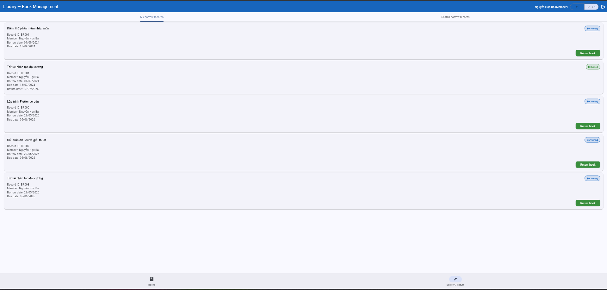
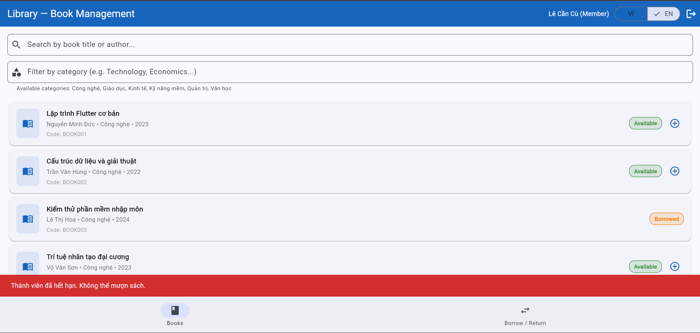
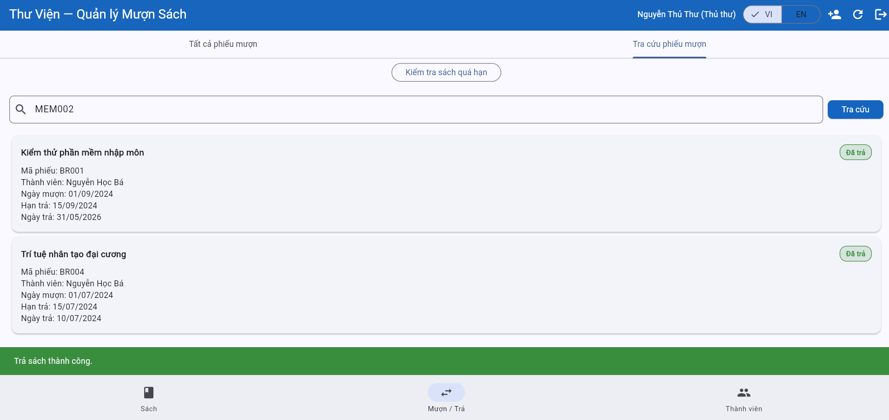
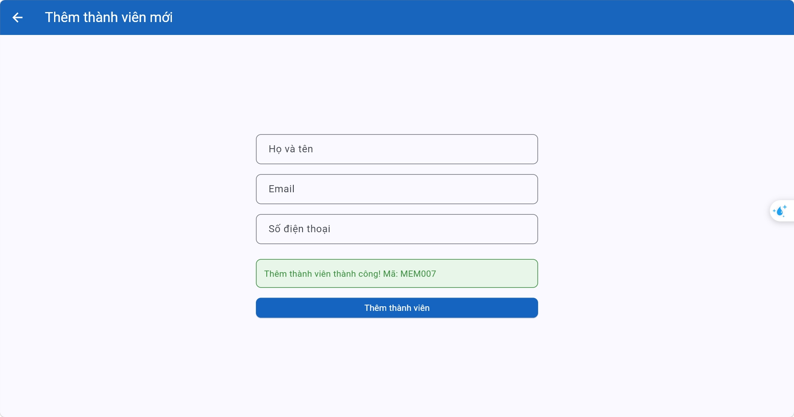
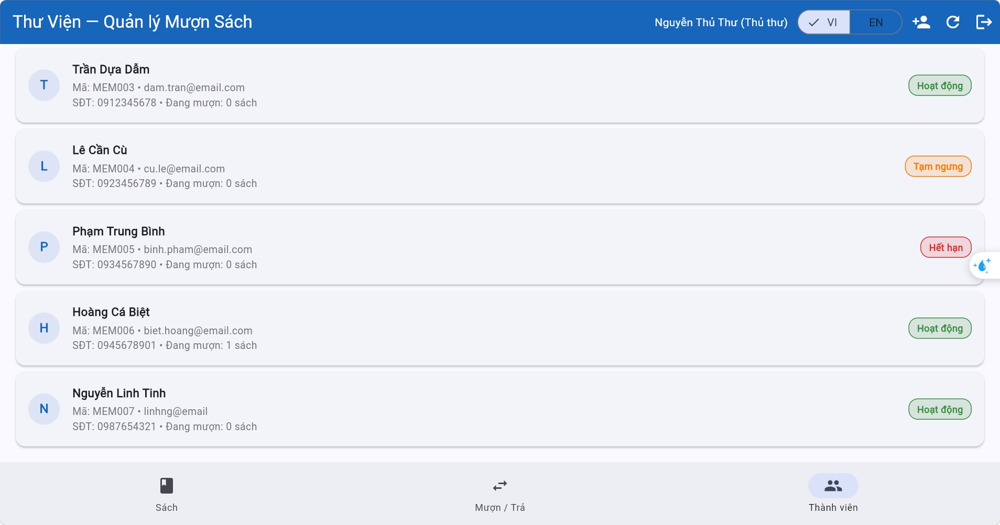
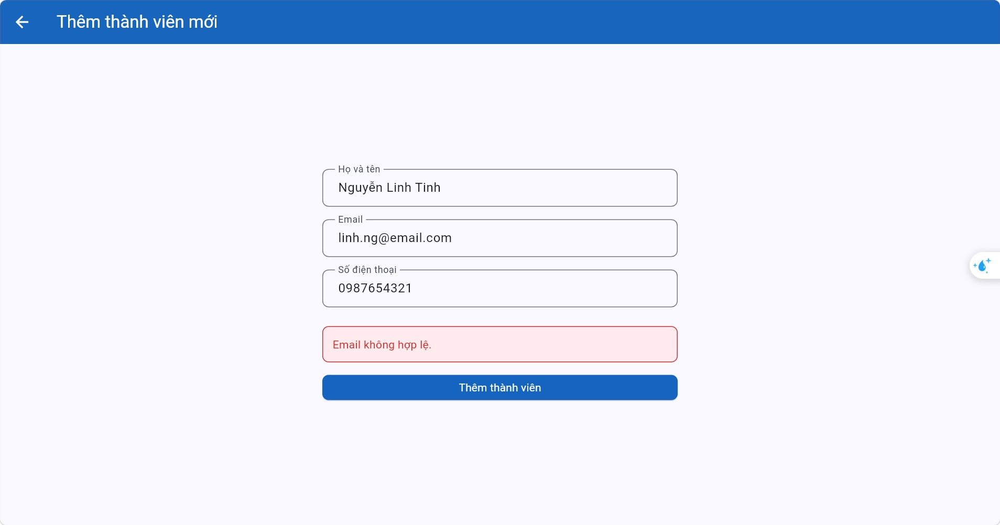
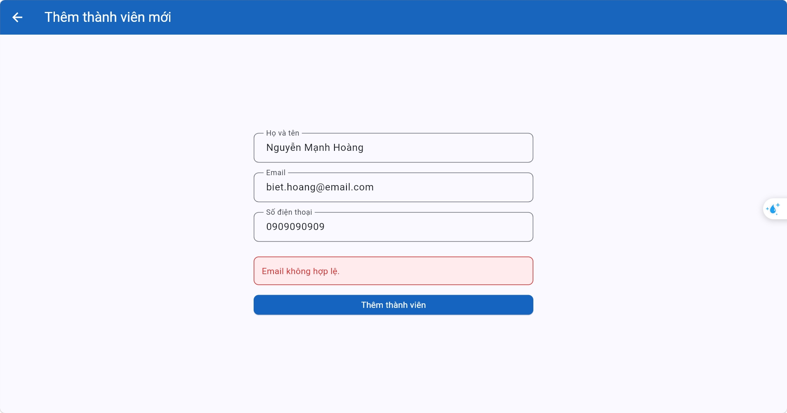
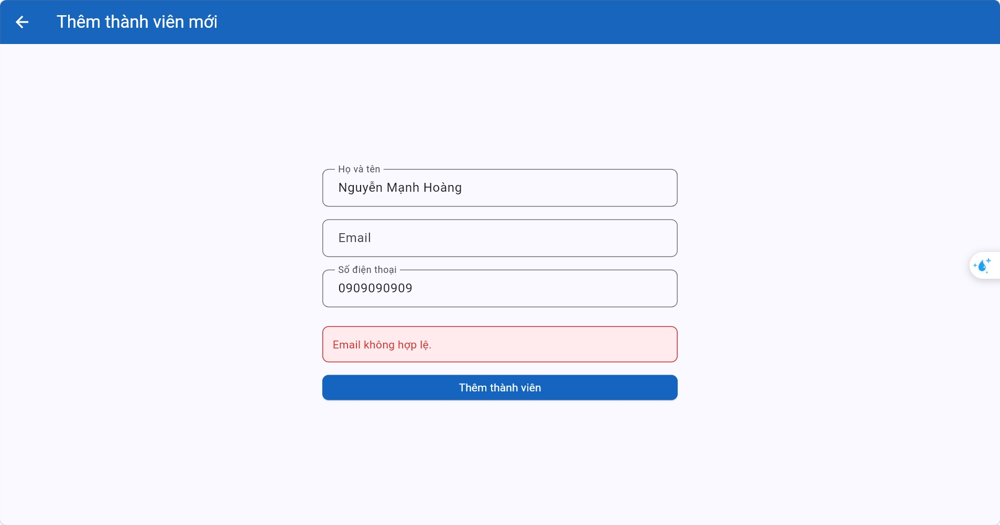
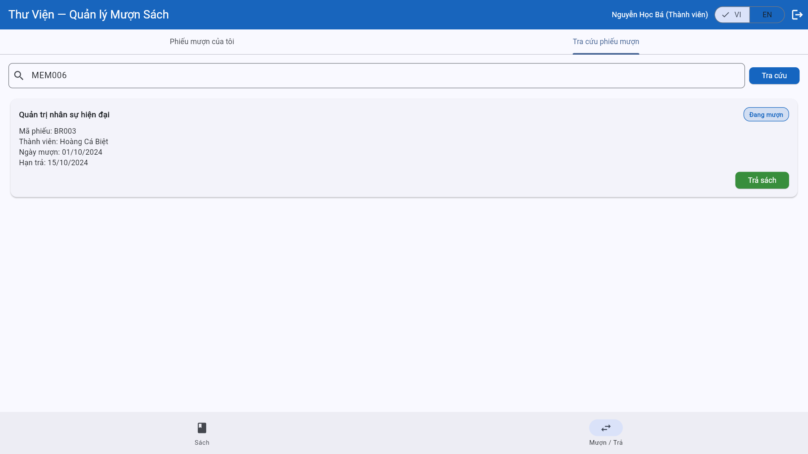

# Bug Reports

| Information | |
|---|---|
| **Group** | GROUP 8 |
| **Date Report** | 02/06/2026 |
| **Browser** | Chrome 148.0.7778.179 |
| **Operating System** | Windows 11 |
| **Interface Language** | Vietnamese |

---

## BUG-01 - Category filter is case-sensitive instead of case-insensitive

| Attribute | Details |
|-----------|---------|
| **Bug ID** | BUG-01 |
| **Related TC** | TC-06 |
| **Related REQ** | REQ-03 |
| **Severity** | Medium |
| **Reported by** | Lê Đức Minh |
| **Date Reported** | 26/05/2026 |
| **Status** | Open |

**Preconditions:**
Login successful with any valid account.

**Steps to Reproduce:**
1. Open the Book List page
2. Enter category keyword `kinh tế` or `KINH TẾ` into the category filter box

**Expected Result:**
Display books in category Kinh tế (BOOK007, BOOK014, BOOK015)

**Actual Result:**
Display message: "Không tìm thấy sách nào."

**Impact:**
Prevents users from finding existing books if the keyword case doesn't perfectly match, worsening the search experience.

**Evidence:**

**Suggested Fix:**
Apply case-insensitive formatting (e.g., .toLowerCase()) to both the user's input and the database categories before comparing.

---

## BUG-02 - An active member can borrow the fourth book

| Attribute | Details |
|-----------|---------|
| **Bug ID** | BUG-02 |
| **Related TC** | TC-02 |
| **Related REQ** | REQ-04 |
| **Severity** | High |
| **Reported by** | Nguyễn Danh Kiên |
| **Date Reported** | 21/05/2026 |
| **Status** | Open |

**Preconditions:**
Login successfully on active account ba.nguyen@email.com and have 3 books borrowed.

**Steps to Reproduce:**
1. Click on the **Mượn sách này** symbol.
2. Confirm borrowing book.

**Expected Result:**
Error returned stating a member can only borrow up to 3 books. The book stays available. The borrow book count remains unchanged.

**Actual Result:**
Display confirm message: **Mượn sách thành công!**. A borrow card for the book appear in "**Mượn / Trả**" tab. The book state become "**Đang mượn**".

**Impact:**
Violates a core business rule, allowing members to bypass the maximum limit of 3 borrowed books.

**Evidence:**

**Suggested Fix:**
Add validation in the client-side borrow logic to count the member's current active borrow records and block the transaction if the count is ≥ 3 before updating state.

---

## BUG-03 - System reports suspended members as expired when rejecting book borrowing

| Attribute | Details |
|-----------|---------|
| **Bug ID** | BUG-03 |
| **Related TC** | TC-03 |
| **Related REQ** | REQ-04 |
| **Severity** | High |
| **Reported by** | Nguyễn Danh Kiên |
| **Date Reported** | 21/05/2026 |
| **Status** | Open |

**Preconditions:**
Login successfully on suspended account **cu.le@email.com**.

**Steps to Reproduce:**
1. Click on the **Mượn sách này** symbol.
2. Confirm borrowing book.

**Expected Result:**
Notification: "**Thành viên đã tạm ngưng. Không thể mượn sách.**"

**Actual result:**
Notification: "**Thành viên đã hết hạn. Không thể mượn sách.**"

**Impact:**
Misleads users regarding their actual account status, potentially causing confusion and incorrect support requests.

**Evidence:**

**Suggested Fix:**
Fix the conditional logic to correctly map the "Suspended" account status to its specific error message instead of defaulting to "Expired".

---

## BUG-04 - No warning message when returning the book late

| Attribute | Details |
|-----------|---------|
| **Bug ID** | BUG-04 |
| **Related TC** | TC-02 |
| **Related REQ** | REQ-05 |
| **Severity** | Low |
| **Reported by** | Nguyễn Đức Minh |
| **Date Reported** | 27/05/2026 |
| **Status** | Open |

**Preconditions:**
Login successfully on active account that has 1 book borrowed overdue.

**Steps to Reproduce:**
1. Go to **Mượn / Trả** tab.
2. Click **Trả sách** at borrow record.

**Expected Result:**
Record status updates to 'Đã trả', book status updates to 'Có sẵn', and a warning message 'Trả sách quá hạn!' (assumed wording) is displayed.

**Actual Result:**
Update record and book status but do not display warning message.

**Impact:**
Fails to notify librarians and users of overdue status, which may lead to uncollected penalty fees or tracking issues.

**Evidence:**

**Suggested Fix:**
Implement a check to compare actual_return_date with due_date to trigger the overdue warning UI during the return process.

---

## BUG-05 - Add Member: Email validation accepts domain without dot

| Attribute | Details |
|-----------|---------|
| **Bug ID** | BUG-05 |
| **Related TC** | TC-03 |
| **Related REQ** | REQ-07 |
| **Severity** | High |
| **Reported by** | Phí Lê Bảo Linh |
| **Date Reported** | 28/05/2026 |
| **Status** | Open |

**Preconditions:**
Login successful as librarian. Add Member page is open.

**Steps to Reproduce:**
1. Enter valid full name: `Nguyễn Linh Tinh`
2. Enter email missing a dot in domain: `linhng@email`
3. Enter valid phone number: `0987654321`
4. Click "**Thêm thành viên**" button.

**Expected Result:**
System blocks submission and displays error: "**Email không hợp lệ.**". No new member is added.

**Actual Result:**
System passes validation and creates the member successfully.

**Impact:**
Allows invalid data entry into the system, which will cause email notification delivery failures for those members.

**Evidence:**
 

**Suggested Fix:**
Update the email validation Regex to strictly require a dot and a top-level domain.

---

## BUG-06 - Add Member: Incorrect email validation overrides specific validation messages

| Attribute | Details |
|-----------|---------|
| **Bug ID** | BUG-06 |
| **Related TC** | TC-01, TC-04, TC-05, TC-07 |
| **Related REQ** | REQ-07 |
| **Severity** | High |
| **Reported by** | Phí Lê Bảo Linh |
| **Date Reported** | 28/05/2026 |
| **Status** | Open |

**Preconditions:**
Login successful as librarian. Add Member page is open. Click "Đặt lại dữ liệu" before each case to reset system state.

**Steps to Reproduce:**
1. Open the Add Member form.
2. Enter input data as specified per case below.
3. Click "**Thêm thành viên**".
4. Observe the system response.

| Case | Full Name | Email | Phone | Expected | Actual | Blocks |
|------|-----------|-------|-------|----------|--------|--------|
| 1 | `Nguyễn Linh Tinh` | `linh.ng@email.com` *(valid)* | `0987654321` | Member created successfully | Msg: "**Email không hợp lệ.**" | TC-01 |
| 2 | `Nguyễn Biết Tuốt` | `biet.hoang@email.com` *(duplicate)* | `0918273645` | Msg: "**Email đã tồn tại.**" | Msg: "**Email không hợp lệ.**" | TC-04 |
| 3 | `Nguyễn Linh Tinh` | *(empty)* | `0987654321` | Msg: "**Email không được để trống.**" | Msg: "**Email không hợp lệ.**" | TC-05 |
| 4 | `Nguyễn Linh Tinh` | `linh.ng@email.com` *(valid)* | *(empty)* | Msg: "**Số điện thoại không được để trống.**" | Msg: "**Email không hợp lệ.**" - phone validation never reached | TC-07 |

**Impact:**
- Members cannot be added even with fully valid data, blocking a core librarian workflow.
- Duplicate and empty email errors are hidden, preventing users from identifying and correcting their actual input mistake.
- Phone validation is completely unreachable, leaving TC-07 in a **Blocked** state.

**Evidence:**  
 — Case 1: Valid email rejected  
 — Case 2: Duplicate email shows wrong message  
 — Case 3: Empty email shows wrong message

**Suggested Fix:**
Separate and prioritize validation steps: 1. Check if empty → 2. Check format → 3. Check for duplicates in the database → 4. Proceed to phone validation. → Returning specific messages for each step.

---

## BUG-07 - Member can look up others' book records

| Attribute | Details |
|-----------|---------|
| **Bug ID** | BUG-07 |
| **Related TC** | TC-07 |
| **Related REQ** | REQ-08 |
| **Severity** | High |
| **Reported by** | Nguyễn Vân Khánh |
| **Date Reported** | 20/05/2026 |
| **Status** | Open |

**Preconditions:**
- Login successful as ba.nguyen@email.com
- `MEM006` is a valid Member ID belonging to another member in the DB.

**Steps to Reproduce:**
1. Go to “**Tra cứu phiếu mượn**”.
2. Enter `MEM006` into the search field.
3. Click “**Tra cứu**”.

**Expected Result:**
Empty list. Not allowed to view other members' borrow records.

**Actual Result:**
Display record `BR003` belongs to MEM006.

**Impact:**
Critical privacy breach; exposes users' personal borrowing histories to unauthorized members.

**Evidence:**

**Suggested Fix:**
Implement server-side authorization checks to ensure the querying user can only fetch records matching their currently authenticated Member ID.
