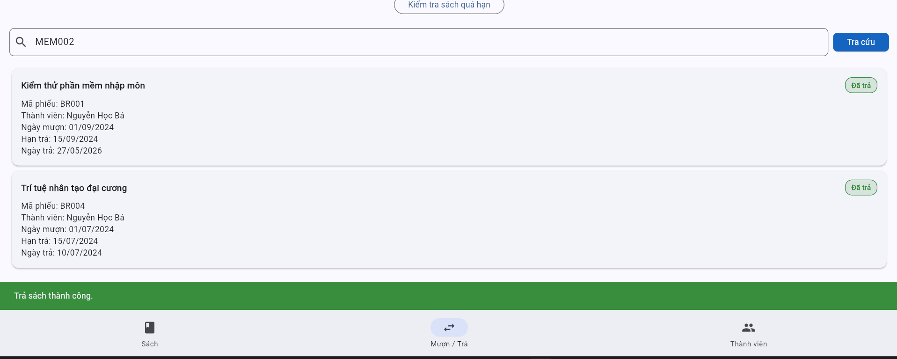

# Bug Reports — Báo cáo lỗi

> **Hướng dẫn**: Tạo 1 mục bug cho mỗi TC có kết quả **Fail**.
> Xem [examples/sample-bug-report.md](../examples/sample-bug-report.md) để hiểu cách viết bug report tốt.
> Mỗi bug cần: tiêu đề mô tả hành vi lỗi, bước tái hiện, expected vs actual, severity + giải thích.

---

## BUG-01

| Thuộc tính | Chi tiết |
|-----------|---------|
| **Mã lỗi** | BUG-01 |
| **TC liên quan** | TC05-01 |
| **REQ liên quan** | REQ05 |
| **Mức độ** | Low |
| **Người phát hiện** | Nguyễn Đức Minh |
| **Ngày phát hiện** | 27/05/2026 |
| **Trạng thái** | Open |

**Tiêu đề:**
No warning message when returning the book late

**Môi trường:**
- Trình duyệt: Chrome Version 148.0.7778.179
- Hệ điều hành: Window 11
- Ngôn ngữ giao diện: Tiếng Việt

**Điều kiện tiên quyết:**
- Member havent returned the book
- The record has dueDate < currentDate

**Bước tái hiện:**
1. Click on "Kiểm tra sách quá hạn"
2. Search up "MEM002" in "Tra cứu phiếu mượn" category
3. Click on "Trả sách"

**Kết quả mong đợi:**
The record is marked as "Đã trả" and a warning message "Đã quá hạn trả sách"

**Kết quả thực tế:**
The record is marked as "Đã trả" and a message "Trả sách thành công"

**Tác động:**
Violate the rule requirement, affecting the library's overdue management process

**Minh chứng:**
`<!-- Đính kèm ảnh chụp màn hình nếu có -->`
> e.g. ![BUG-01] 

**Đề xuất xử lý:**
Add a warning message "Đã quá hạn trả sách" after member returning the book late

---

## BUG-02

| Thuộc tính | Chi tiết |
|-----------|---------|
| **Mã lỗi** | BUG-02 |
| **TC liên quan** | `<!-- TC-xx -->` |
| **REQ liên quan** | `<!-- REQ-xx -->` |
| **Mức độ** | `<!-- High / Medium / Low -->` |
| **Người phát hiện** | `<!-- Họ tên thành viên -->` |
| **Ngày phát hiện** | `<!-- DD/MM/YYYY -->` |
| **Trạng thái** | `<!-- Open / Closed -->` |

**Tiêu đề:**
`<!-- Mô tả hành vi lỗi -->`

**Bước tái hiện:**
1. `<!-- -->`
2. `<!-- -->`
3. `<!-- -->`

**Kết quả mong đợi:**
`<!-- -->`

**Kết quả thực tế:**
`<!-- -->`

**Tác động:**
`<!-- -->`

**Minh chứng:**
`<!-- -->`

**Đề xuất xử lý:**
`<!-- -->`

---

<!-- Copy template BUG trên để thêm BUG-03, BUG-04, ... cho mỗi TC Fail -->
