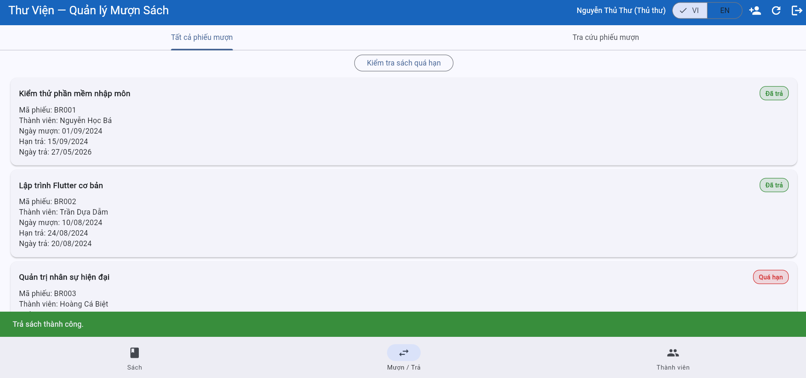

# Test Execution — Kết quả thực thi kiểm thử

> **Hướng dẫn**: Chạy từng TC trên hệ thống https://stqa.rbc.vn, ghi lại kết quả thực tế.
> Kết luận: **Pass** (kết quả đúng), **Fail** (kết quả sai → tạo bug report), **Blocked** (không thực hiện được vì lỗi khác chặn), **Not Run** (chưa chạy).

---

## Kết quả chi tiết

| Mã TC | Nhóm chức năng | Kết quả mong đợi (tóm tắt) | Kết quả thực tế | Kết luận | Minh chứng | Bug |
|-------|---------------|---------------------------|-----------------|---------|-----------|----| 
| TC05-01 | Verify user not returning book | Marked as "Đã trả" + Warning message | Only marked as "Đã trả"  | Fail |  | Bug-01 |
| TC05-02 | Verify user return book late | Marked as "Đã trả" | Marked as "Đã trả" | Pass | | |
| TC05-03 | Verify suspended or expired user | Display"KHông tìm thấy phiếu mượn" | Display "Không tìm thấy phiếu mượn" | Pass | | |
| TC06-01 | Marking overdue record | Mark as "Quá hạn" | Mark as "Quá hạn" | Pass | | |
| TC06-02 | Librarian Checking ovedue records| Display ovedue records: BR001, BR003, BR005 | Display over records: BR001, BR003, BR005 | Pass | | |
| TC06-03 | Members MEM002 checking overdue records| Display overdue record BR001 | Display overdue record BR001 | Pass | | |  

---

## Tổng hợp kết quả

| Chỉ số | Giá trị |
|--------|---------|
| Tổng số test case | `<!-- số -->` |
| Pass | `<!-- số -->` |
| Fail | `<!-- số -->` |
| Blocked | `<!-- số -->` |
| Not Run | `<!-- số -->` |
| **Tỷ lệ Pass** | `<!-- xx% -->` |

### Kết quả theo nhóm chức năng

| Nhóm | Tổng TC | Pass | Fail | Tỷ lệ Pass |
|------|---------|------|------|------------|
| | | | | |
